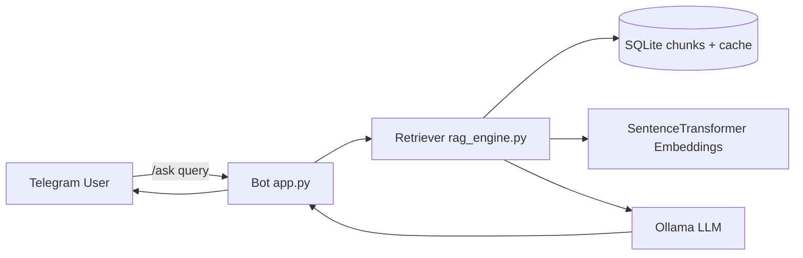
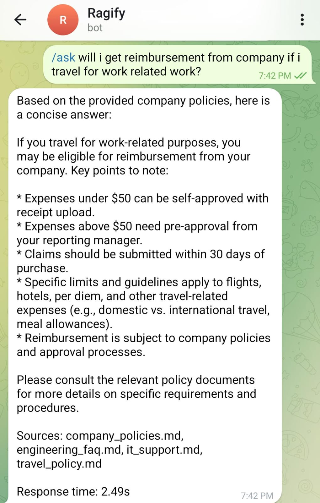
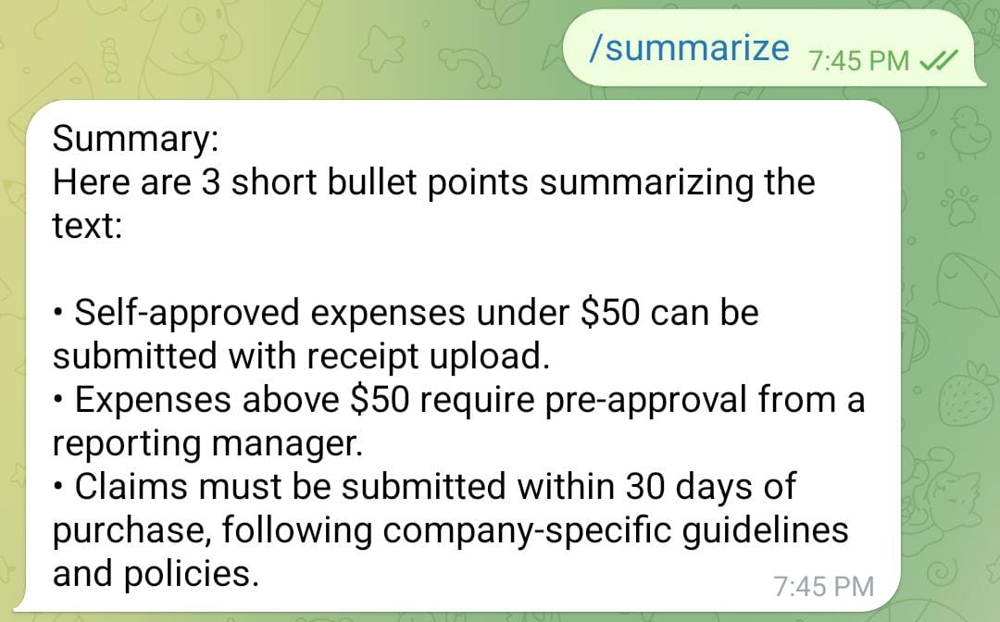
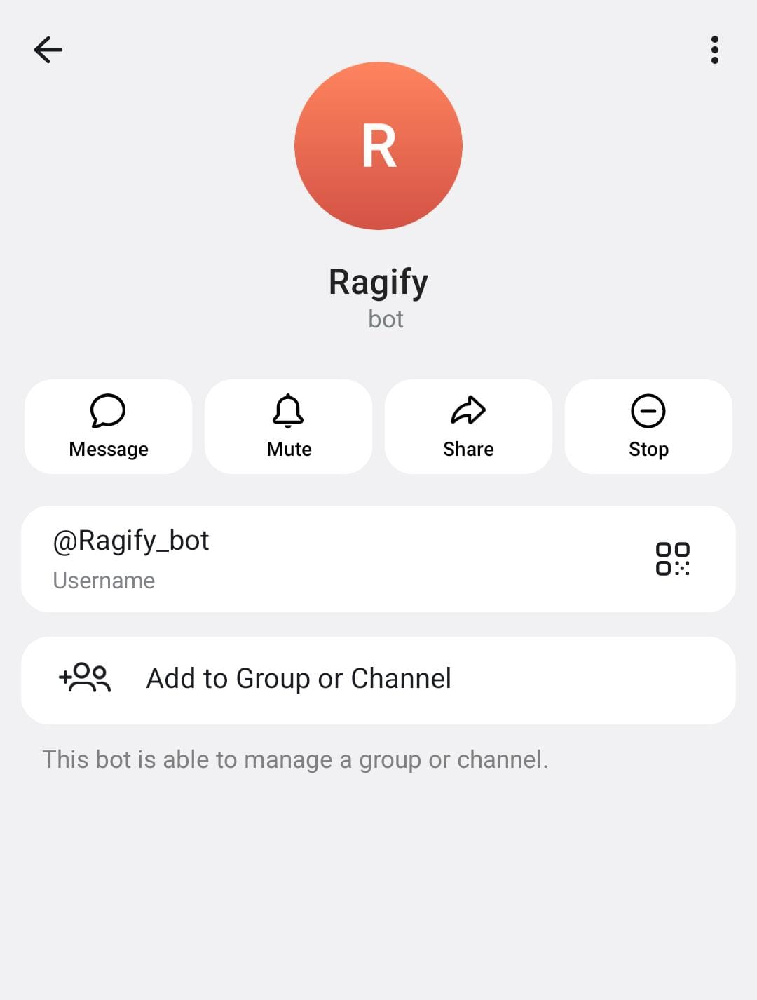
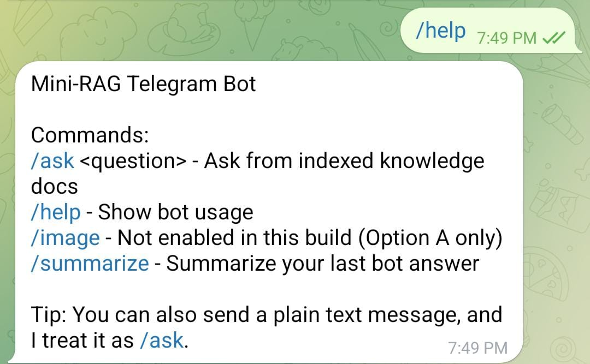
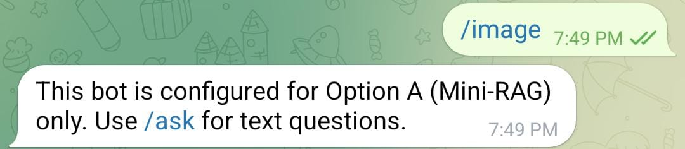

# Mini-RAG Telegram Bot (Option A)

This project implements **Option A (Mini-RAG)** from the assignment.
It builds a Telegram bot that answers `/ask` queries using a local document knowledge base.

## Features

- Telegram bot with required commands:
  - `/ask <query>`: Retrieve and answer from local docs
  - `/help`: Usage instructions
  - `/image`: Handled gracefully (this build is Option A only)
- Local RAG pipeline:
  1. Read 3-5 local Markdown/TXT docs
  2. Split into chunks
  3. Embed using `all-MiniLM-L6-v2`
  4. Store embeddings in local SQLite
  5. Retrieve top-k chunks for every query
  6. Build context prompt and call local LLM via Ollama
- Optional enhancements included:
  - Last 3 interactions stored per user (short history)
  - Query embedding cache (`query_cache` table)
  - Source snippets shown in bot responses
  - `/summarize` command to summarize the last answer

## Project Structure

- `app.py` - Telegram bot handlers and orchestration
- `rag_engine.py` - Chunking, indexing, retrieval, prompting
- `knowledge_base/` - Example documents used for retrieval
- `requirements.txt` - Python dependencies
- `.env.example` - Environment variables template

## Prerequisites

- Python 3.10+
- Telegram bot token (from BotFather)
- Ollama installed and running locally

Example Ollama setup:
- `ollama serve`
- `ollama pull llama3.2:3b`

## Setup

A local virtual environment has been created at `.venv`.

1. Open terminal in project folder.
2. Activate venv:
   - macOS/Linux: `source .venv/bin/activate`
3. Install dependencies:
   - `pip install -r requirements.txt`
4. Configure env:
   - `cp .env.example .env`
   - Set `TELEGRAM_BOT_TOKEN` in `.env`

## Run

```bash
python app.py
```

On startup, the bot indexes documents from `knowledge_base/` into `rag_store.db`.

## How Data Flows



## Notes

- This implementation intentionally focuses on **Option A only**.
- `/image` command returns a clear message that image mode is not enabled.
- To use your own docs, replace files in `knowledge_base/` and restart bot.

## Demo Checklist (for submission)

Capture screenshots/GIF showing:
1. `/help` output
2. `/ask` query and answer with sources
3. `/summarize` output
4. `/image` command response (Option A notice)

## Demo Screenshots

These are the recorded examples saved in `Results/`:

- `Results/1000232264.jpg` - `/ask` and response + sources
- `Results/1000232265.jpg` - `/help` response
- `Results/1000232266.jpg` - `/image` response (Option A notice)
- `Results/1000232267.jpg` - `/summarize` response
- `Results/1000232268.jpg` - Bot profile view


### Visual preview











