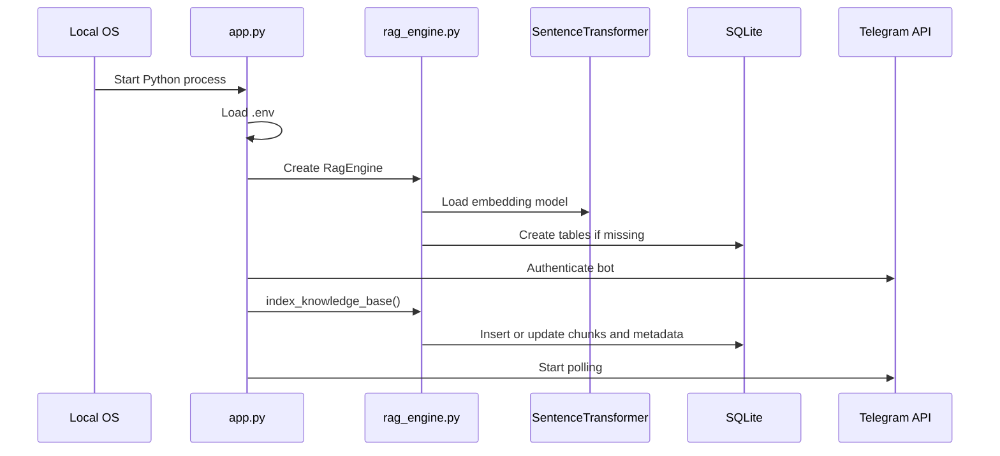
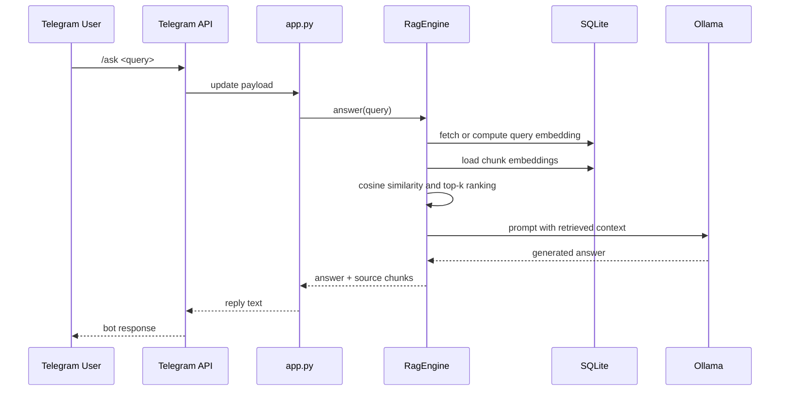

# Mini-RAG Telegram Bot: Detailed Working Guide

This document explains the internal working of the Mini-RAG Telegram bot implementation in this project. It is written so another engineer can understand the architecture, runtime flow, storage model, prompt construction, indexing behavior, and operational dependencies without needing to reverse-engineer everything from source.

---

## 1. Purpose of the System

This project implements **Option A: Mini-RAG** from the assignment.

The system answers user questions on Telegram by following this sequence:

1. Receive a text question from a Telegram user.
2. Search a small local knowledge base.
3. Retrieve the most relevant text chunks.
4. Build a prompt using those retrieved chunks.
5. Send that prompt to a local LLM served by Ollama.
6. Return the generated answer to the user on Telegram.

This is a **Retrieval-Augmented Generation (RAG)** system because the language model is grounded on retrieved local content instead of being trusted to answer from its own parametric knowledge alone.

---

## 2. High-Level Components

The implementation is split into the following runtime components.

### 2.1 Telegram Bot Application

Implemented in [app.py](app.py).

Responsibilities:

- Bootstraps configuration from environment variables.
- Initializes the RAG engine.
- Registers Telegram command handlers.
- Receives user messages and commands.
- Calls the RAG engine for indexing, retrieval, answering, and summarization.
- Sends responses back to Telegram users.

### 2.2 RAG Engine

Implemented in [rag_engine.py](rag_engine.py).

Responsibilities:

- Reads knowledge base files from disk.
- Splits documents into chunks.
- Generates embeddings using a local embedding model.
- Stores chunk text and embeddings in SQLite.
- Retrieves top-k relevant chunks for each query.
- Builds a prompt from retrieved context.
- Calls the Ollama-hosted LLM.
- Returns final answer and source chunks.

### 2.3 Knowledge Base

Stored in [knowledge_base/company_policies.md](knowledge_base/company_policies.md), [knowledge_base/engineering_faq.md](knowledge_base/engineering_faq.md), [knowledge_base/it_support.md](knowledge_base/it_support.md), and [knowledge_base/travel_policy.md](knowledge_base/travel_policy.md).

Responsibilities:

- Serves as the source data for retrieval.
- Contains small, human-readable policy and FAQ content.
- Can be replaced with other `.md` or `.txt` files.

### 2.4 SQLite Storage

Created at runtime as `rag_store.db` in the project root.

Responsibilities:

- Stores indexed document chunks.
- Stores document-level hashes for incremental re-indexing.
- Stores cached query embeddings.

### 2.5 Ollama Runtime

External runtime dependency.

Responsibilities:

- Hosts the local generation model specified in environment configuration.
- Receives prompt messages from the RAG engine.
- Returns generated responses.

### 2.6 Embedding Model

Configured by default as `all-MiniLM-L6-v2`.

Responsibilities:

- Converts document chunks into dense vector embeddings.
- Converts user questions into dense vector embeddings.
- Enables semantic retrieval by vector similarity.

---

## 3. Runtime Dependency Model

At runtime, the solution depends on **two active processes**:

1. **Python bot process** running [app.py](app.py)
2. **Ollama process/service** serving the LLM

The bot process communicates with the following systems:

- Telegram over HTTP through `python-telegram-bot`
- Ollama over HTTP through the `ollama` Python client
- SQLite via Python's built-in `sqlite3`
- Local model files through `sentence-transformers`

This means the system is not a single monolithic server. It is one application process plus one local LLM runtime.

---

## 4. End-to-End Data Flow

### 4.1 Startup Flow

When [app.py](app.py) starts, the sequence is:

1. `.env` values are loaded using `python-dotenv`.
2. Logging is configured.
3. `RagEngine` is instantiated.
4. The embedding model is loaded into memory.
5. SQLite schema is initialized if missing.
6. Telegram handlers are registered.
7. During bot startup via `post_init`, knowledge base indexing runs.
8. The Telegram bot begins polling for updates.

### Startup sequence diagram

### 4.2 User Query Flow

When a user sends `/ask What is the leave policy?`, the runtime path is:

1. Telegram receives the message.
2. Telegram Bot API exposes the update.
3. The bot polls Telegram and receives the update.
4. The `/ask` handler extracts the query text.
5. The handler calls `RAG.answer(question)` in a worker thread.
6. The RAG engine retrieves relevant chunks:
   - gets or computes query embedding
   - loads stored chunk embeddings from SQLite
   - computes cosine similarity in Python
   - sorts by score
   - selects top-k chunks
7. The engine builds a context block from those chunks.
8. The engine sends system prompt and user prompt to Ollama.
9. Ollama returns a generated answer.
10. The app stores the last interaction in per-user memory.
11. The app appends source document names and response time.
12. The answer is sent back to the user on Telegram.

### Query sequence diagram

---

## 5. File-Level Responsibilities

### 5.1 [app.py](app.py)

This is the orchestration layer.

#### Main responsibilities

- Load configuration from environment variables.
- Construct `RagEngine`.
- Define Telegram command handlers.
- Manage short-term interaction memory per user.
- Trigger indexing on startup.
- Send response text safely in Telegram-sized chunks.

#### Important constructs

##### `Exchange`

A small dataclass storing:

- `question`
- `answer`

It is used for short conversational memory.

##### `BotState`

Maintains:

- `history: dict[int, deque[Exchange]]`

This stores the **last 3 interactions per user**.

##### `get_config()`

Reads environment variables and returns a dictionary containing:

- bot token
- knowledge base directory
- database path
- embedding model name
- Ollama host
- Ollama model name
- retrieval `top_k`
- maximum prompt context size

##### `safe_reply()`

Telegram has message size limits. This helper:

- checks that `update.message` exists
- splits long responses into chunks
- sends multiple reply messages if needed

##### Command handlers

- `help_command()`: usage instructions
- `ask_command()`: handles `/ask <query>`
- `image_command()`: explicitly rejects image mode because this build is Option A only
- `summarize_command()`: summarizes the last bot answer
- `text_query_handler()`: treats plain text as an implicit query
- `image_upload_handler()`: gracefully rejects uploaded images

##### `ask_and_reply()`

This is the central orchestration method for answering user questions.

Detailed behavior:

1. Resolve current user ID.
2. Record request start time.
3. Call `RAG.answer(question)` on a background thread.
4. Receive `answer` and retrieved chunks.
5. Store the interaction in per-user history.
6. Extract source document names.
7. Append response time.
8. Send the formatted response back to the user.

##### `on_startup()`

Called by the Telegram application post-init hook.

Behavior:

- Logs indexing start.
- Calls `RAG.index_knowledge_base()` on a worker thread.
- Logs the number of indexed files and chunks.

##### `main()`

Bootstraps the app.

Behavior:

- Validates bot token presence.
- Creates an explicit event loop for Python 3.14 compatibility.
- Builds the Telegram application.
- Registers handlers.
- Starts polling.

### 5.2 [rag_engine.py](rag_engine.py)

This is the core retrieval and generation layer.

#### `RetrievedChunk`

Dataclass representing one search result.

Fields:

- `source`: source filename
- `chunk_text`: the retrieved text chunk
- `score`: cosine similarity score

#### `RagEngine.__init__()`

Initializes the engine with configuration.

Internal state created here:

- knowledge base directory path
- SQLite database path
- embedding model name
- selected Ollama model name
- retrieval size (`top_k`)
- prompt context size limit
- `SentenceTransformer` instance
- Ollama `Client` instance

Then it calls `_initialize_schema()`.

---

## 6. Database Design

The database schema is created automatically in `_initialize_schema()`.

### 6.1 `chunks` table

Stores the searchable chunk corpus.

Columns:

- `id`: integer primary key
- `source`: filename of original document
- `chunk_index`: position of chunk within document
- `chunk_text`: actual chunk content
- `embedding_json`: serialized embedding vector as JSON text
- `doc_hash`: SHA-256 hash of original document contents
- `created_at`: timestamp

Purpose:

- This is the main retrieval table.
- Every chunk becomes one row.
- Embeddings are stored as JSON text rather than a specialized vector type.

### 6.2 `indexed_documents` table

Stores document-level indexing metadata.

Columns:

- `source`: filename, primary key
- `doc_hash`: SHA-256 hash of full file content
- `updated_at`: last indexing timestamp

Purpose:

- Supports incremental indexing.
- If a file has not changed since the last indexing run, it is skipped.

### 6.3 `query_cache` table

Stores cached query embeddings.

Columns:

- `query_hash`: normalized query hash, primary key
- `query_text`: original query text
- `embedding_json`: serialized query vector
- `created_at`: timestamp

Purpose:

- Avoids recomputing embeddings for repeated queries.
- Reduces latency for repeated lookups.

### 6.4 Index

A SQLite index is created on `chunks(source)`.

Purpose:

- Improves document-based lookup performance.
- It is not used for vector similarity itself.

---

## 7. Indexing Flow in Detail

Indexing occurs in `index_knowledge_base()`.

### 7.1 Document discovery

The method `_iter_documents()`:

- checks that the knowledge directory exists
- collects all `*.md` and `*.txt` files
- sorts them
- returns the file list

### 7.2 Hashing for change detection

For each document:

- file text is read as UTF-8
- SHA-256 hash is computed using `_sha256()`
- existing hash is checked in `indexed_documents`

If the hash is unchanged:

- indexing is skipped for that file

### 7.3 Chunking

If a document changed, `_split_into_chunks()` is used.

Chunking behavior:

- strips trailing whitespace on lines
- keeps paragraph boundaries where possible
- targets roughly `700` characters per chunk
- uses `120` characters of overlap for oversized paragraph splitting

Why chunking is needed:

- embedding entire large documents is less precise for retrieval
- smaller chunks improve semantic search granularity
- smaller context blocks make prompt construction cleaner

### 7.4 Embedding generation

Each chunk is embedded by `_embed()`.

Behavior:

- calls `SentenceTransformer.encode()`
- uses `normalize_embeddings=True`
- converts vectors to Python lists for JSON serialization

Why normalization matters:

- normalized vectors allow cosine similarity to be computed as a dot product
- this makes similarity computation simpler and faster

### 7.5 Storage update

For updated documents:

- existing rows for that document are deleted using `_delete_document_chunks()`
- new chunk rows are inserted into `chunks`
- document metadata is upserted into `indexed_documents`

### 7.6 Removed document cleanup

If a previously indexed document no longer exists in the folder:

- its `chunks` rows are deleted
- its `indexed_documents` row is deleted

### 7.7 Indexing return value

The method returns:

- number of indexed files
- number of inserted chunks

---

## 8. Retrieval Flow in Detail

Retrieval happens in `retrieve(query, top_k=None)`.

### 8.1 Query embedding

The query is embedded through `_query_embedding()`.

Behavior:

1. Normalize the query string for hashing using lowercase and strip.
2. Compute the query hash.
3. Check `query_cache`.
4. If cached, load the stored embedding.
5. Otherwise, generate the embedding and store it in cache.

### 8.2 Chunk loading

All chunk rows are loaded from SQLite with:

- `source`
- `chunk_text`
- `embedding_json`

### 8.3 Similarity computation

For each stored chunk:

- `embedding_json` is parsed from JSON into a list of floats
- cosine similarity is computed using `_cosine_similarity_from_normalized()`

Because vectors are normalized, the implementation computes:

$$
    ext{similarity}(a, b) = \sum_i a_i b_i
$$

This is the dot product of normalized vectors and is equivalent to cosine similarity.

### 8.4 Ranking

All candidate chunks are:

- wrapped as `RetrievedChunk`
- sorted descending by similarity score
- truncated to top-k results

### 8.5 Output

The method returns a list of retrieved chunks.

---

## 9. Prompt Construction and Answer Generation

Generation happens in `answer(query)`.

### 9.1 Retrieve top chunks

The method first calls `retrieve(query)`.

### 9.2 Build context

The retrieved chunks are passed to `_build_context()`.

Behavior:

- prefixes each chunk with an index and source file name
- concatenates them into one prompt context block
- truncates when total context exceeds `max_context_chars`

Example internal context shape:

- `[1] Source: company_policies.md ...`
- `[2] Source: engineering_faq.md ...`

### 9.3 System prompt

The system prompt instructs the model to:

- act as a helpful assistant
- answer only from provided context
- admit when the answer is unavailable in context

### 9.4 User prompt

The user prompt contains:

- original question
- retrieved context
- instruction to answer concisely with key points

### 9.5 Ollama request

The `_chat()` method sends:

- `model=<configured model>`
- `messages=[system, user]`
- `temperature=0.2`

Low temperature is used to reduce hallucination and variability.

### 9.6 Failure handling

If the Ollama call fails:

- the function does not crash the bot
- it returns a readable message explaining that relevant context was found but local LLM execution failed

### 9.7 Final output

The method returns a tuple:

- generated answer text
- retrieved chunks

The caller in [app.py](app.py) uses the chunks to display source filenames.

---

## 10. Summarization Flow

The optional `/summarize` command is implemented through `summarize_text()`.

Flow:

1. The bot checks the current user's history.
2. It finds the latest stored bot answer.
3. It sends that answer to the LLM with a summarization prompt.
4. The summary is returned to the user.

This path does not re-run retrieval. It summarizes the last answer only.

---

## 11. User Interaction Modes

### 11.1 `/help`

Returns usage instructions.

### 11.2 `/ask <query>`

Primary entry point for RAG.

### 11.3 Plain text message

Handled as an implicit query and functionally equivalent to `/ask`.

### 11.4 `/image`

Explicitly unsupported in this submission because the selected assignment track is Option A only.

### 11.5 Uploaded image

Also explicitly rejected with a clear text response.

### 11.6 `/summarize`

Summarizes the last answer returned to the same user.

---

## 12. Working Principle of RAG in This Project

This project follows a standard retrieval-augmented pattern.

### Step 1: Knowledge externalization

Instead of hardcoding answers, source documents are stored separately in a knowledge base folder.

### Step 2: Semantic indexing

Each chunk is converted into a vector embedding so text with similar meaning can be matched even when exact words differ.

### Step 3: Query-time retrieval

When a user asks a question, the system does not send the entire knowledge base to the LLM. It retrieves only the most semantically relevant chunks.

### Step 4: Prompt grounding

Only retrieved chunks are provided to the model as context.

### Step 5: Controlled generation

The model is instructed to answer only using that provided context.

This design improves:

- answer relevance
- answer grounding
- maintainability
- updateability of knowledge without retraining any model

---

## 13. Why SQLite Is Used Here

SQLite is used as both:

- a normal relational store
- a simple embedding store

Important implementation detail:

- SQLite is **not** acting as a native vector database in this implementation.
- Embeddings are stored as JSON text.
- Similarity search is performed in Python after loading embeddings.

This design was chosen because:

- it is lightweight
- it avoids extra infrastructure
- it is easy to explain and run locally
- it fits the scale of a small assignment

Trade-off:

- this approach does not scale well to large corpora because all embeddings are read and scored in Python
- for larger systems, a native vector index or specialized vector store would be better

---

## 14. Why Ollama Is Used Here

Ollama provides a local way to run a generation model.

Benefits:

- no external paid API is required
- local control over model execution
- easier local demo story
- simple HTTP-based integration

The bot does not directly generate answers. It delegates answer generation to the Ollama-served model.

---

## 15. Environment Variables

Configured in `.env`.

### `TELEGRAM_BOT_TOKEN`

Token for Telegram bot authentication.

### `KNOWLEDGE_DIR`

Folder containing `.md` and `.txt` documents.

### `DB_PATH`

Location of the SQLite database file.

### `EMBEDDING_MODEL`

Sentence transformer model used for embeddings.

### `OLLAMA_HOST`

Base URL of the running Ollama service.

### `OLLAMA_MODEL`

Generation model used by Ollama.

### `TOP_K`

Maximum number of retrieved chunks used for answering.

### `MAX_CONTEXT_CHARS`

Upper bound on prompt context size.

---

## 16. Performance Characteristics

### 16.1 Fast enough for small corpora

For 3-5 short documents, performance is acceptable because:

- embedding count is low
- SQLite reads are small
- Python similarity scoring is cheap at this scale

### 16.2 Main latency contributors

Total response time is mostly affected by:

1. Ollama generation latency
2. Embedding model load and warm-up
3. First-time model downloads
4. Telegram network round trips

### 16.3 Cached query embeddings

Repeated questions avoid recomputing the query embedding. This helps reduce latency slightly.

### 16.4 Cold start cost

The first startup can be slower because:

- `sentence-transformers` may download the embedding model
- Ollama may need model warm-up

---

## 17. Fault Tolerance and Edge Cases

### 17.1 Missing bot token

The app fails early with a clear runtime error.

### 17.2 Missing knowledge base

If the knowledge folder is empty or missing:

- indexing returns `(0, 0)`
- retrieval will find no context
- the answer path returns a helpful fallback message

### 17.3 Ollama unavailable

If Ollama is not running or the model is missing:

- retrieval may still succeed
- generation fails gracefully with an explanatory error message

### 17.4 Very long responses

Responses are split into Telegram-safe message chunks before sending.

### 17.5 Python 3.14 event loop behavior

The app explicitly creates an event loop before starting polling to avoid startup failure on Python 3.14.

---

## 18. Security and Operational Notes

### 18.1 Bot token sensitivity

The Telegram bot token is a secret and should not be committed or shared. If exposed, it should be regenerated in BotFather.

### 18.2 Local-only model execution

Ollama is expected to run on `localhost`. This is appropriate for local development.

### 18.3 No authentication layer for app internals

This project is an assignment-oriented local build, not a production-hardened service.

---

## 19. Current Limitations

1. Retrieval is brute-force over all stored embeddings.
2. Embeddings are stored as JSON text instead of an optimized vector format.
3. User history is in-memory only, so it resets on restart.
4. There is no conversation-aware retrieval; history is stored but not injected into retrieval prompts.
5. There is no admin command to force reindexing on demand.
6. There is no webhook-based Telegram deployment; polling is used.
7. There is no document ingestion UI; files are added manually.

---

## 20. How to Extend This System

Possible engineering improvements include the following.

### 20.1 Better vector storage

- Replace JSON embedding storage with `sqlite-vec` or a dedicated vector database.
- Use approximate nearest neighbor search for scalability.

### 20.2 Better chunking

- Token-aware chunking
- Heading-aware chunking
- Metadata-rich chunk objects

### 20.3 Better prompting

- Cite chunk indices in the answer.
- Use a stricter answer template.
- Add fallback behavior for weak retrieval.

### 20.4 Better bot operations

- `/reindex` command
- health check command
- admin-only commands

### 20.5 Better persistence

- Persist user history in SQLite.
- Add request logs and analytics.

### 20.6 Better deployment

- Dockerize the bot plus Ollama composition.
- Run the bot under a process manager.
- Deploy on a VM with Ollama preloaded.

---

## 21. Practical Mental Model for Another Engineer

Another engineer can think of the system as:

- **Telegram bot** = transport layer and user interface
- **RagEngine** = retrieval layer, prompt builder, and LLM bridge
- **SQLite** = local lightweight content index
- **SentenceTransformer** = semantic encoder
- **Ollama** = local text generator
- **Knowledge base files** = source of truth

In one sentence:

> The bot receives a user question, semantically finds the most relevant local document chunks from SQLite-backed embeddings, sends those chunks to a local Ollama-hosted model as grounding context, and returns the generated answer to the user on Telegram.

---

## 22. Source Files to Read Next

For implementation details, read in this order:

1. [app.py](app.py)
2. [rag_engine.py](rag_engine.py)
3. [README.md](README.md)
4. The files under [knowledge_base/company_policies.md](knowledge_base/company_policies.md)

---

## 23. Summary

This project is a lightweight, local-first Mini-RAG Telegram bot.

Its main design principles are:

- keep infrastructure minimal
- use local documents as source of truth
- perform semantic retrieval locally
- generate grounded answers through Ollama
- provide a usable bot interface with a small, understandable codebase

It is intentionally optimized for clarity, local execution, and assignment suitability rather than large-scale production search.
